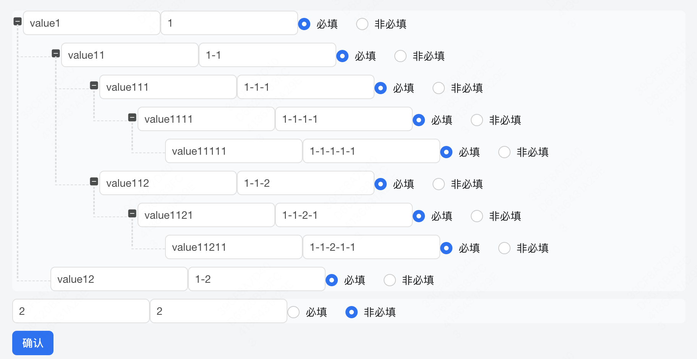

# 要素
* 组件调用自身
组件中调用自身，直接使用组件名标签，要保证循环有结束的出口，避免陷入无限递归
* 事件传递
使用prop属性传递事件不会乱套，直接最终都是调用的顶级组件中的方法，
如果采用emit，在顶级组件中有自定义方法，但是在组件内部绑定的方法不好定义

* 数据传递
同事件传递一样，不要使用v-model，而是采用prop属性传递修改数据的函数

* css样式
subtree中的tree-item要设置横线和竖线元素，其中竖线设置为100%高度且都向上偏移，另外对于最后一个子元素要设置固定的高度32，也就是一行tree-item的高度

# 效果
